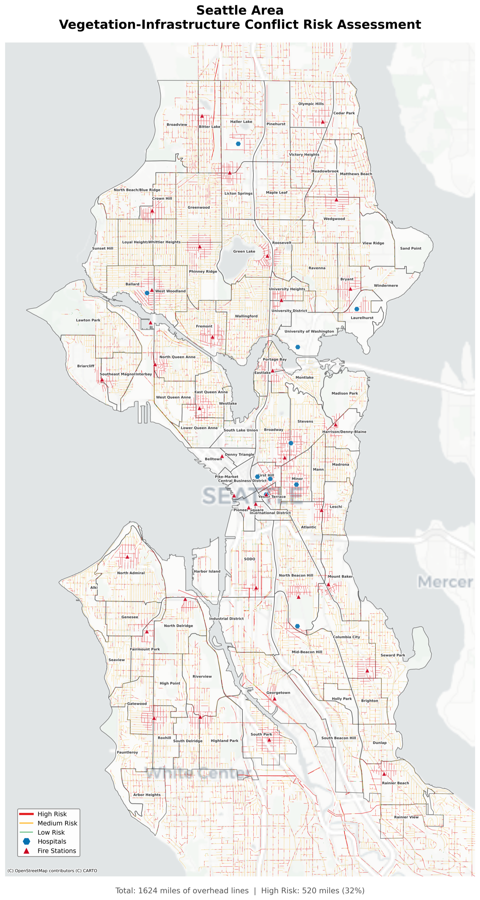

# Vegetation-Infrastructure Conflict Prioritization Model

## Seattle City Light Portfolio Project

A GIS-based risk model that identifies and prioritizes overhead power line segments for vegetation management, helping utility crews focus proactive trimming efforts where they matter most.



---

## Overview

Vegetation contact is a leading cause of power outages. This project implements a spatial risk scoring model that analyzes Seattle City Light's overhead distribution network to identify line segments with the highest vegetation-related risk.

### Key Outputs
- **1,624 miles** of overhead lines analyzed
- **109,187** individual line segments scored
- **520 miles** classified as high risk (32%)
- Interactive priority lists for field crews

---

## Quick Start

```bash
# 1. Install dependencies
pip install -r requirements.txt

# 2. Run the full analysis pipeline
python scripts/01_load_and_check.py
python scripts/02_prep_data.py
python scripts/03_buffer_analysis.py
python scripts/04_canopy_intersection.py
python scripts/05_proximity_analysis.py
python scripts/06_risk_scoring.py
python scripts/07_summarize.py
python scripts/08_visualize.py
```

---

## Risk Scoring Model

Each line segment receives a composite risk score based on three weighted factors:

| Factor | Weight | Description |
|--------|--------|-------------|
| **Vegetation Load** | 50% | Tree canopy coverage within 15-foot buffer |
| **Critical Facility Proximity** | 30% | Distance to hospitals and fire stations |
| **Segment Length** | 20% | Longer segments = more exposure |

### Risk Tiers
- **High Risk** (top 20%): Immediate attention required
- **Medium Risk** (middle 40%): Regular maintenance priority
- **Low Risk** (bottom 40%): Routine monitoring

---

## Project Structure

```
VegetationRisk_SCL/
├── data/
│   ├── raw/                    # Original shapefiles
│   └── processed/              # Analysis outputs (GeoPackage)
├── scripts/
│   ├── 01_load_and_check.py    # Data validation
│   ├── 02_prep_data.py         # Filter & clean
│   ├── 03_buffer_analysis.py   # Create clearance zones
│   ├── 04_canopy_intersection.py # Calculate vegetation load
│   ├── 05_proximity_analysis.py  # Critical facility distance
│   ├── 06_risk_scoring.py      # Composite risk calculation
│   ├── 07_summarize.py         # Neighborhood aggregation
│   └── 08_visualize.py         # Map generation
├── outputs/
│   ├── neighborhood_summary.csv
│   └── priority_segments.csv
├── maps/
│   ├── citywide_risk_map.png
│   └── detail_high_risk_area.png
├── docs/
│   ├── methodology.md          # Technical documentation
│   └── process_log.md          # Run history
├── requirements.txt
└── README.md
```

---

## Data Sources

| Dataset | Records | Source |
|---------|---------|--------|
| Tree Canopy (2021) | 408,646 polygons | Seattle GIS Open Data |
| SCL Power Lines | 147,538 segments | Seattle City Light |
| SCL Poles | 101,269 points | Seattle City Light |
| Fire Stations | 36 points | Seattle GIS Open Data |
| Hospitals | 19 points | Seattle GIS Open Data |
| Neighborhoods | 94 polygons | Seattle GIS Open Data |

---

## Key Findings

### Top 5 High-Risk Neighborhoods

| Neighborhood | Total Miles | High Risk Miles | % High Risk |
|-------------|-------------|-----------------|-------------|
| First Hill | 3.4 | 2.9 | 85% |
| Yesler Terrace | 3.0 | 2.5 | 81% |
| Laurelhurst | 3.0 | 2.0 | 58% |
| Harrison/Denny-Blaine | 3.7 | 2.2 | 57% |
| Minor | 14.5 | 8.8 | 54% |

### Risk Distribution

- **High Risk**: 21,838 segments (519.6 miles)
- **Medium Risk**: 43,674 segments (997.4 miles)
- **Low Risk**: 43,675 segments (107.5 miles)

---

## Technical Requirements

- Python 3.9+
- GeoPandas 0.14+
- Shapely 2.0+
- Matplotlib 3.7+

See `requirements.txt` for full dependency list.

---

## Methodology

For detailed technical documentation, see [docs/methodology.md](docs/methodology.md).

### Key Assumptions
- 15-foot buffer approximates distribution clearance zone
- Tree canopy indicates vegetation presence (not species or growth rate)
- Model is predictive only (no historical outage validation)

---

## Future Enhancements

1. Validate with historical outage data
2. Incorporate tree species and growth rates
3. Add weather/wind exposure factors
4. Weight by downstream customer count
5. Integrate with maintenance scheduling systems

---

## Author

**Moses Trundle-Strachan**
Geography & Data Science Student at University of Washington

Portfolio project for GIS Analyst Internship at Seattle City Light.

---

## License

This project uses publicly available data from Seattle GIS Open Data Portal.
